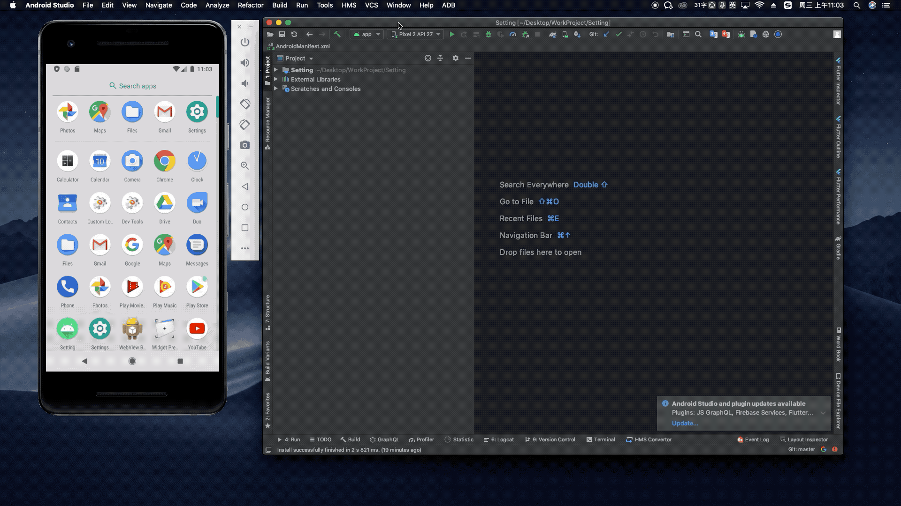
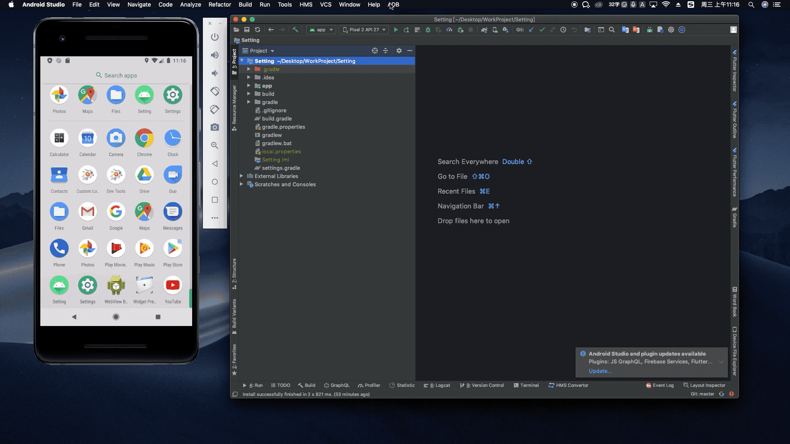

# ADBHelper

## Description
An Android Studio plug-in based on ADB to help you develop faster.

The address of the plug-in is https://plugins.jetbrains.com/plugin/14333-adbhelper

You can use this plugin to do these things

- Get app start time
- Quickly clear debug app data
- Get current activity and fragment information of the App
- Quickly start the app settings page
- UrlScheme Test Helper

## Usage Examples

### For All Apps

The order of operation of this example is

- UrlScheme Test Helper
- Get current activity and fragment information of the App
- Start the app settings page

### For Debug Apps

The order of operation of this example is

- Get app start time
- Clear debug app data
